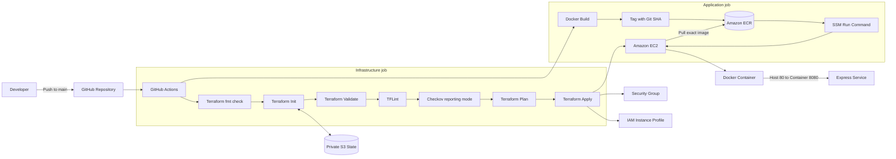

# CI/CD with Terraform and AWS

[](https://github.com/AbbassHarbi/CI-CD-with-Terraform-and-AWS/actions/workflows/deploy.yaml)

An end-to-end DevOps portfolio project that provisions AWS infrastructure with Terraform, builds and publishes a Docker image to Amazon ECR, and deploys the commit-tagged image to Amazon EC2 through GitHub Actions — with AWS Systems Manager as the sole deployment and management channel.

> **Project status:** The delivery pipeline is complete and hardened. Deployment runs entirely through Systems Manager (the public SSH surface has been retired end to end), pre-apply quality gates are enforced by the workflow (format, validation, TFLint, and Checkov in reporting mode), and the instance runs with an encrypted root volume and IMDSv2 required. The next tracked phases are container security, a load-balanced public endpoint, and GitHub OIDC.


---

## Table of contents

- [Overview](#overview)
- [Architecture](#architecture)
- [Delivery workflow](#delivery-workflow)
- [Implemented features](#implemented-features)
- [Technology stack](#technology-stack)
- [Repository structure](#repository-structure)
- [Terraform quality gates](#terraform-quality-gates)
- [Identity and access model](#identity-and-access-model)
- [Prerequisites](#prerequisites)
- [Required GitHub configuration](#required-github-configuration)
- [Deployment](#deployment)
- [Verification](#verification)
- [Troubleshooting highlights](#troubleshooting-highlights)
- [Security considerations](#security-considerations)
- [Cleanup](#cleanup)
- [Roadmap](#roadmap)
- [Author](#author)

---

## Overview

The project automates the path from a source-code change to a running containerized application:

```text
Git push
  → GitHub Actions
  → Terraform Plan and Apply
  → Docker build
  → Amazon ECR push
  → EC2 image pull
  → Docker container deployment
  → Live Express application
```

The workload is a lightweight Node.js/Express service that listens on container port `8080`. Docker publishes it through EC2 host port `80`.

The project focuses on:

- Reproducible infrastructure provisioning
- Automated image build and delivery
- Artifact traceability through Git commit SHA tags
- Remote Terraform state
- Separation of CI publisher and EC2 runtime identities
- Deployment and management without public SSH (Systems Manager)
- Pre-apply Terraform quality gates
- Practical troubleshooting across Git, YAML, Bash, Terraform, IAM, ECR, Docker, and EC2

---

## Architecture



### Trust boundaries

```text
GitHub Actions identity
  ├── Terraform state access
  ├── AWS infrastructure deployment
  ├── ECR image publishing
  └── SSM command delivery (tag-scoped to the project instance)

EC2 runtime identity
  ├── ECR read/pull access through an instance profile
  └── SSM agent channel through the same instance profile
```

The GitHub runner and EC2 instance are separate execution environments. Each authenticates to AWS independently for its own responsibilities. No long-lived credential or SSH key ever reaches the instance.

---

## Delivery workflow

The workflow is defined in:

```text
.github/workflows/deploy.yaml
```

It runs on pushes to `main` and contains two dependent jobs.

### 1. `deploy-infra`

```text
Checkout repository
  → Setup Terraform
  → Check formatting
  → Initialize provider and S3 backend
  → Validate Terraform
  → Setup and initialize TFLint
  → Run TFLint
  → Run Checkov (reporting mode)
  → Create saved Terraform plan
  → Apply saved plan
  → Publish EC2 instance ID as a job output
```

### 2. `deploy-app`

This job waits for `deploy-infra` to succeed.

```text
Checkout repository
  → Receive EC2 instance ID from the infrastructure job
  → Authenticate GitHub runner to ECR
  → Build Docker image
  → Tag image with Git commit SHA
  → Push image to node.app repository
  → Send a Run Command to the tagged instance (script templated from scripts/deploy-ec2.sh)
  → On EC2: ensure the host toolbox, authenticate to ECR with the instance role,
    pull the exact commit-tagged image, replace the container, health-check the application
```

Deployment is a Systems Manager Run Command: the workflow targets the instance by ID (never by address), waits for terminal state, and fails the pipeline when the remote script exits non-zero. The remote script is a repository-tracked template whose run-specific values (registry, repository, commit SHA, region) are substituted before submission, and the payload is JSON-encoded with `jq`.

### Artifact handoff

The Docker image is the artifact passed from CI to CD:

```text
CI artifact: ECR/node.app:<git-commit-sha>
CD result:   The same image running on EC2
```

Deployment by immutable image digest is the next container-security step (see Roadmap).

---

## Implemented features

### Application and container

- Minimal Node.js/Express HTTP service
- Node.js 22 container runtime
- Docker image build in GitHub Actions
- Host port `80` mapped to container port `8080`
- Commit-SHA image tagging
- Private ECR image publishing

### Infrastructure as Code

- EC2 instance provisioning (encrypted root volume, EBS-optimized, IMDSv2 required)
- Security-group provisioning
- IAM instance-profile association
- SSM managed-instance policy attachment (Terraform-managed)
- Private S3 remote state
- Terraform outputs passed between workflow jobs

### CI/CD

- Push-triggered GitHub Actions workflow
- Saved Terraform execution plan
- Automatic infrastructure reconciliation
- Automated image build, push, pull, and container replacement
- Systems Manager Run Command deployment with in-script health check
- Cross-job orchestration with `needs` and job outputs

### Security posture

- No public SSH: deployment and management via Systems Manager only, scoped by instance tags
- IMDSv2 required on the instance (SSRF hardening)
- Encrypted root volume, EBS-optimized storage
- Least-privilege policies separated by responsibility; permissions removed when their consumer was removed
- Commit-SHA traceability between source and deployed image

---

## Technology stack

| Area | Technology |
|---|---|
| Source control | Git and GitHub |
| CI/CD | GitHub Actions |
| Infrastructure as Code | Terraform |
| Cloud provider | AWS |
| Compute | Amazon EC2 |
| Container registry | Amazon ECR |
| State storage | Amazon S3 |
| Identity and access | AWS IAM roles, policies, and instance profiles |
| Containerization | Docker |
| Application | Node.js and Express |
| Terraform linting | TFLint with AWS ruleset |
| IaC security scanning | Checkov (reporting mode) |
| Deployment and management transport | AWS Systems Manager (Run Command, Session Manager) |

---

## Repository structure

```text
.
├── .github/
│   └── workflows/
│       └── deploy.yaml
├── Terraform/
│   ├── .tflint.hcl
│   ├── main.tf
│   ├── variables.tf
│   └── .terraform.lock.hcl
├── aws-terraform-github-actions-cicd/
│   ├── app.js
│   ├── Dockerfile
│   ├── package.json
│   └── package-lock.json
├── scripts/
│   └── deploy-ec2.sh
├── docs/
│   └── images/
│       └── project-overview.png
├── .gitignore
└── README.md
```

Generated files, state, credentials, saved plans, and `node_modules/` are not committed.

---

## Terraform quality gates

The infrastructure job runs checks from fastest and least consequential to most environment-aware:

```text
fmt → init → validate → TFLint → Checkov (reporting) → plan → apply
```

### Format check

```bash
terraform fmt -check -recursive -diff
```

Ensures committed Terraform follows canonical formatting. CI checks but does not silently rewrite source.

### Validate

```bash
terraform validate -no-color
```

Checks Terraform structure, references, argument types, required fields, and initialized provider schemas.

### TFLint

```bash
tflint --init
tflint --format compact
```

Adds Terraform and AWS-specific quality checks (pinned CLI and AWS ruleset versions, committed `.tflint.hcl`). Findings fail the job before Plan/Apply.

### Checkov (reporting mode)

```yaml
uses: bridgecrewio/checkov-action@v12
with:
  directory: ./Terraform
  framework: terraform
  soft_fail: true
```

Scans the configuration against IaC security policies. Findings are triaged one by one (fix / owned exception with removal plan / evidenced false positive). Enforcement (`soft_fail: false`) is the next step after the remaining documented exceptions are implemented.

### Plan

```bash
terraform plan ... -out=PLAN
```

Compares configuration, state, and provider data, then saves the proposed execution plan.

### Apply

```bash
terraform apply PLAN
```

Applies the exact saved plan only after previous gates pass.

---

## Identity and access model

### GitHub Actions deployment identity

The current baseline uses a dedicated IAM user whose credentials are stored as GitHub Actions secrets.

Its permissions are separated by responsibility:

- Terraform state access to the intended S3 path
- EC2 and instance-profile deployment operations for `us-east-1` (key-pair operations were removed when SSH was retired)
- ECR authentication and image publishing, scoped to the project repository
- Constrained `ssm:SendCommand`, conditioned on the instance tags `Environment=dev` and `Name=ec2_1`
- Constrained `iam:PassRole` for the EC2 runtime role

### EC2 runtime identity

The EC2 instance receives the `EC2ECR-AUTH` role through an instance profile.

The role provides ECR read-only behavior and the SSM managed-instance core policy (the attachment is Terraform-managed), so EC2 can authenticate to ECR and receive commands without any stored credential on the server.

### `iam:PassRole`

`PassRole` allows the deployment identity to configure EC2 with the approved role. It does not let GitHub inherit or assume the role.

---

## Prerequisites

Before deployment, the current baseline expects:

- An AWS account
- A GitHub repository
- Terraform-compatible AWS permissions for the GitHub deployment identity
- A private S3 bucket for remote Terraform state
- An ECR private repository named `node.app` in the target region
- An IAM role named `EC2ECR-AUTH` that:
  - Trusts `ec2.amazonaws.com`
  - Has ECR read-only permissions
  - Has the SSM managed-instance core policy (Terraform-managed attachment)
- An AMI that ships the SSM Agent (the project AMI does)

> The S3 backend bucket, ECR repository, and the `EC2ECR-AUTH` role itself are currently bootstrap prerequisites rather than resources fully managed by this Terraform root module. Moving them under Terraform management is tracked in the roadmap.

---

## Required GitHub configuration

Configure under:

```text
Repository Settings → Secrets and variables → Actions
```

| Name | Purpose |
|---|---|
| `AWS_ACCESS_KEY_ID` | Identifies the dedicated GitHub AWS credential |
| `AWS_SECRET_ACCESS_KEY` | Authenticates the matching AWS credential |
| `AWS_TF_STATE_BUCKET_NAME` | Selects the private Terraform state bucket |
| `AWS_REGION` | Selects the AWS region |

The former SSH secrets were removed from the workflow and deleted from the repository when the SSH surface was retired.

Never commit secret values to the repository.

---

## Deployment

The normal deployment path is GitHub-driven.

```bash
git add .
git commit -m "Describe the change"
git push
```

A push to `main` starts the workflow automatically.

### Local Terraform checks

From the Terraform directory:

```bash
terraform fmt -recursive
terraform init -backend=false
terraform validate -no-color
```

Do not run a local Apply unless the backend, variables, AWS identity, account, region, and proposed changes have been reviewed deliberately.

---

## Verification

### GitHub Actions

Confirm both jobs are green:

```text
deploy-infra ✅
deploy-app   ✅
```

### ECR

Confirm `node.app` contains an image tagged with the triggering Git commit SHA.

### EC2 container

Open an SSM Session Manager shell on the instance (no SSH is required or available) and inspect:

```bash
docker ps -a
docker logs myappcontainer
docker images
ss -lntp | grep ':80'
curl -i http://localhost/
```

### Systems Manager

The instance appears as a managed node in Fleet Manager, and the command history shows each deployment with its commit-labeled comment.

### Application

From EC2:

```bash
curl -i http://localhost/
```

From a browser:

```text
http://<EC2_PUBLIC_IP>/
```

The current public IP is visible in the EC2 Console. A stable, load-balanced endpoint replaces it in the next architecture phase.

Expected response:

```text
Server is up and running!
```

---

## Troubleshooting highlights

The project was completed through systematic, layer-by-layer troubleshooting.

| Problem | Root cause | Resolution |
|---|---|---|
| Git push timeout | Network connectivity | Diagnosed TCP 443 before credentials |
| Push denied to wrong account | Cached Git identity | Corrected Git Credential Manager account |
| Terraform folder not found | Linux path case sensitivity | Matched `Terraform` capitalization |
| S3 state 403 | Missing backend IAM access | Added scoped state policy |
| Terraform Plan argument error | YAML/Bash continuation | Used a literal block and correct line endings |
| EC2/IAM 403 | Missing deployment actions | Added constrained infrastructure policy |
| Invalid SSH public key | Wrong format/value | Registered valid OpenSSH key |
| Invalid workflow step | Incorrect YAML indentation | Moved `run`/`working-directory` to step scope |
| ECR token denied | Publisher lacked ECR permission | Added ECR publisher access |
| Dockerfile not found | Wrong build context | Built from application directory |
| Docker CMD failure | Incorrect startup command | Used `CMD ["node", "app.js"]` |
| Missing ECR repository | Repository not created | Created `node.app` |
| Old ECR login syntax | AWS CLI v1/v2 difference | Used `get-login-password` |
| HTTP connection refused | Container exited/runtime mismatch | Upgraded Node and fixed container command |
| Metadata options 403 on apply | Deployment policy lacked `ec2:ModifyInstanceMetadataOptions` (a distinct API from `ModifyInstanceAttribute`) | Added exactly that action to the region-scoped statement |

---

## Security considerations

### Current strengths

- No credential values committed to Git
- Private remote Terraform state with scoped access
- EC2 receives temporary role credentials; CI publisher and EC2 runtime identities are separated
- `iam:PassRole` constrained to the intended role and service
- No public SSH: deployment and management flow exclusively through Systems Manager, scoped by instance tags
- IMDSv2 required on the instance; the application container is locked out of the credentials channel by hop limit
- Encrypted root volume and EBS-optimized storage
- Image tags connect artifacts to source commits
- Pre-apply quality gates (format, validation, TFLint, Checkov reporting)
- Least-privilege policies that evolve with the code — permissions are removed when their consumer is removed

### Current limitations

Documented, owned exceptions (each with a removal plan, rather than suppressed scanner findings):

- **Public HTTP on the instance (port 80 from all IPv4).** The application is intentionally a public plain-HTTP service; no load balancer or TLS exists yet. Removal plan: a load-balanced endpoint with the instance's inbound restricted to the load balancer's security group and the public IP removed.
- **No detailed (1-minute) CloudWatch monitoring.** Deliberate cost decision for a single lab instance; basic 5-minute metrics remain available. Removal plan: enable when the observability phase is prioritized.

Remaining hardening work:

- Long-lived AWS access keys are stored in GitHub Secrets (replaced by GitHub OIDC in a tracked phase)
- Terraform Apply and deployment run automatically after pushes to `main` (protected environment approval is tracked)
- Checkov runs in reporting mode; enforcement follows the remaining exceptions
- No container-image vulnerability gate yet (Trivy + ECR scan-on-push is the next phase)
- Deployment uses commit-SHA tags; deployment by immutable digest is the next container-security step
- No state locking/concurrency protection yet
- ECR repository, backend bootstrap, and the runtime role are not yet fully managed by the root module
- Security-group egress is broad (restriction is tracked after traffic inventory)
- GitHub Actions are not yet pinned to reviewed immutable commits
- No automated rollback; the deployment performs a post-deployment health check

---

## Cleanup

Review destroy operations before execution:

```bash
terraform plan -destroy
terraform destroy
```

Use the same backend, account, region, and required variables as the deployment.

Do not delete Terraform-managed resources manually unless deliberately performing a documented recovery/import/state operation. Manual deletion creates state drift.

The external bootstrap resources — such as the state bucket and the manually created ECR repository and role — require separate cleanup decisions.

---

## Roadmap

### Terraform and IaC security

- [x] Terraform format gate
- [x] Terraform validation
- [x] TFLint with AWS ruleset
- [x] Checkov in reporting mode
- [x] Triage IaC findings (five closed; two documented exceptions with removal plans)
- [ ] Enforce Checkov before Plan/Apply
- [ ] Add protected environment approval before Apply
- [ ] Add state locking/concurrency protection

### Container security (next phase)

- [ ] Add application tests and linting
- [ ] Add Dockerfile linting
- [ ] Add Trivy image scanning before ECR push
- [ ] Enable/validate ECR image scanning
- [ ] Deploy by immutable image digest

### Observability and reliability

- [ ] Add application health endpoint
- [x] Post-deployment health check (in-script, fails the pipeline)
- [ ] Add rollback behavior
- [ ] Send container/application logs to CloudWatch
- [ ] Add CloudWatch dashboard
- [ ] Add alarms and notifications

### Access and network hardening

- [ ] Replace long-lived GitHub AWS keys with OIDC
- [x] Replace public SSH deployment and management with AWS Systems Manager
- [ ] Replace direct public HTTP with a load-balanced endpoint (inbound restricted to the load balancer, public IP removed)
- [ ] Restrict security-group egress (ingress: port 22 already removed)
- [ ] Pin GitHub Actions to reviewed immutable commits

---

## Author

**Abbass Harbi**

- GitHub: [@AbbassHarbi](https://github.com/AbbassHarbi)
- Project: [CI-CD-with-Terraform-and-AWS](https://github.com/AbbassHarbi/CI-CD-with-Terraform-and-AWS)

---

> **Good DevOps work is not just automation—it is secure, reproducible, observable, and understandable automation.**
