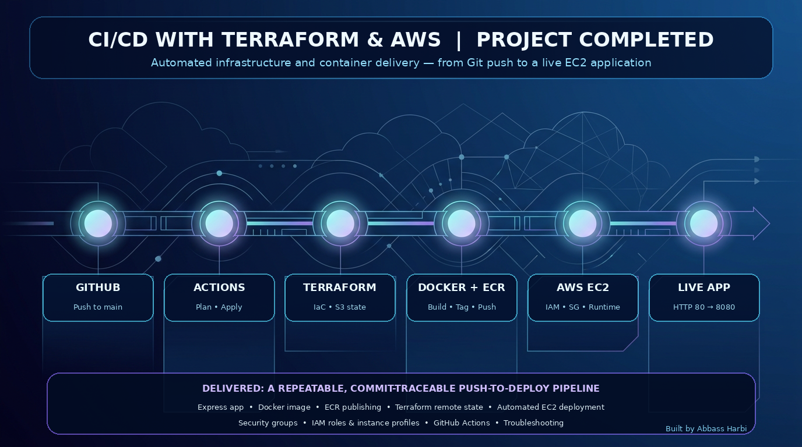
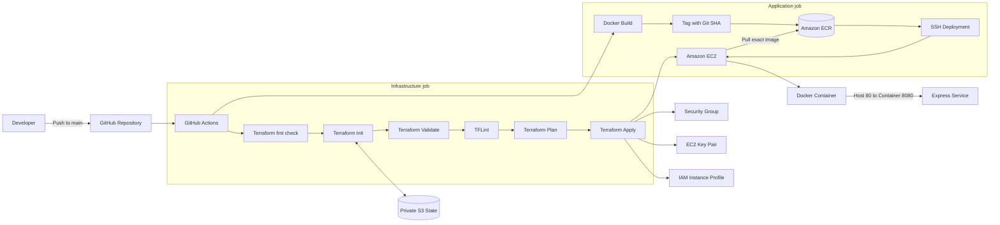

# CI/CD with Terraform and AWS

[](https://github.com/AbbassHarbi/CI-CD-with-Terraform-and-AWS/actions/workflows/deploy.yaml)

An end-to-end DevOps portfolio project that provisions AWS infrastructure with Terraform, builds and publishes a Docker image to Amazon ECR, and deploys the commit-tagged image to Amazon EC2 through GitHub Actions.

> **Project status:** The working CI/CD baseline is complete. Terraform formatting, validation, and TFLint quality gates are implemented. IaC security scanning, container scanning, observability, and access hardening are the next planned enhancements.



---

## Table of contents

- [Overview](#overview)
- [Architecture](#architecture)
- [Delivery workflow](#delivery-workflow)
- [Implemented features](#implemented-features)
- [Technology stack](#technology-stack)
- [Repository structure](#repository-structure)
- [Terraform quality gates](#terraform-quality-gates)
- [Identity and access model](#identity-and-access-model)
- [Prerequisites](#prerequisites)
- [Required GitHub configuration](#required-github-configuration)
- [Deployment](#deployment)
- [Verification](#verification)
- [Troubleshooting highlights](#troubleshooting-highlights)
- [Security considerations](#security-considerations)
- [Cleanup](#cleanup)
- [Roadmap](#roadmap)
- [Author](#author)

---

## Overview

The project automates the path from a source-code change to a running containerized application:

```text
Git push
  → GitHub Actions
  → Terraform Plan and Apply
  → Docker build
  → Amazon ECR push
  → EC2 image pull
  → Docker container deployment
  → Live Express application
```

The workload is a lightweight Node.js/Express service that listens on container port `8080`. Docker publishes it through EC2 host port `80`.

The project focuses on:

- Reproducible infrastructure provisioning
- Automated image build and delivery
- Artifact traceability through Git commit SHA tags
- Remote Terraform state
- Separation of CI publisher and EC2 runtime identities
- Pre-apply Terraform quality gates
- Practical troubleshooting across Git, YAML, Bash, Terraform, IAM, ECR, Docker, and EC2

---

## Architecture



### Trust boundaries

```text
GitHub Actions identity
  ├── Terraform state access
  ├── AWS infrastructure deployment
  └── ECR image publishing

EC2 runtime identity
  └── ECR read/pull access through an instance profile
```

The GitHub runner and EC2 instance are separate execution environments. Each authenticates to ECR independently for its own responsibility.

---

## Delivery workflow

The workflow is defined in:

```text
.github/workflows/deploy.yaml
```

It runs on pushes to `main` and contains two dependent jobs.

### 1. `deploy-infra`

```text
Checkout repository
  → Setup Terraform
  → Check formatting
  → Initialize provider and S3 backend
  → Validate Terraform
  → Setup and initialize TFLint
  → Run TFLint
  → Create saved Terraform plan
  → Apply saved plan
  → Publish EC2 public IP as a job output
```

### 2. `deploy-app`

This job waits for `deploy-infra` to succeed.

```text
Checkout repository
  → Receive EC2 public IP
  → Authenticate GitHub runner to ECR
  → Build Docker image
  → Tag image with Git commit SHA
  → Push image to node.app repository
  → Connect to EC2 over SSH
  → Authenticate EC2 to ECR using its IAM role
  → Pull exact commit-tagged image
  → Replace and start the application container
```

### Artifact handoff

The Docker image is the artifact passed from CI to CD:

```text
CI artifact: ECR/node.app:<git-commit-sha>
CD result:   The same image running on EC2
```

---

## Implemented features

### Application and container

- Minimal Node.js/Express HTTP service
- Node.js 22 container runtime
- Docker image build in GitHub Actions
- Host port `80` mapped to container port `8080`
- Commit-SHA image tagging
- Private ECR image publishing

### Infrastructure as Code

- EC2 instance provisioning
- Security-group provisioning
- EC2 public-key registration
- IAM instance-profile association
- Private S3 remote state
- Terraform outputs passed between workflow jobs

### CI/CD

- Push-triggered GitHub Actions workflow
- Saved Terraform execution plan
- Automatic infrastructure reconciliation
- Automated image build, push, pull, and container replacement
- Cross-job orchestration with `needs` and job outputs

### Terraform quality gates

- Canonical formatting check
- Terraform structural validation
- TFLint core and AWS provider linting
- Plan and Apply blocked when a required gate fails

---

## Technology stack

| Area | Technology |
|---|---|
| Source control | Git and GitHub |
| CI/CD | GitHub Actions |
| Infrastructure as Code | Terraform |
| Cloud provider | AWS |
| Compute | Amazon EC2 |
| Container registry | Amazon ECR |
| State storage | Amazon S3 |
| Identity and access | AWS IAM roles, policies, and instance profiles |
| Containerization | Docker |
| Application | Node.js and Express |
| Terraform linting | TFLint with AWS ruleset |
| Deployment transport | SSH |

---

## Repository structure

```text
.
├── .github/
│   └── workflows/
│       └── deploy.yaml
├── Terraform/
│   ├── .tflint.hcl
│   ├── main.tf
│   ├── variables.tf
│   └── .terraform.lock.hcl
├── aws-terraform-github-actions-cicd/
│   ├── app.js
│   ├── Dockerfile
│   ├── package.json
│   └── package-lock.json
├── docs/
│   └── images/
│       └── project-overview.png
├── .gitignore
└── README.md
```

Generated files, state, private keys, credentials, saved plans, and `node_modules/` must not be committed.

---

## Terraform quality gates

The infrastructure job runs checks from fastest and least consequential to most environment-aware:

```text
fmt → init → validate → TFLint → plan → apply
```

### Format check

```bash
terraform fmt -check -recursive -diff
```

Ensures committed Terraform follows canonical formatting. CI checks but does not silently rewrite source.

### Validate

```bash
terraform validate -no-color
```

Checks Terraform structure, references, argument types, required fields, and initialized provider schemas.

### TFLint

```bash
tflint --init
tflint --format compact
```

Adds Terraform and AWS-specific quality checks. The project uses a committed `.tflint.hcl` configuration for reproducibility.

### Plan

```bash
terraform plan ... -out=PLAN
```

Compares configuration, state, and provider data, then saves the proposed execution plan.

### Apply

```bash
terraform apply PLAN
```

Applies the exact saved plan only after previous gates pass.

---

## Identity and access model

### GitHub Actions deployment identity

The current baseline uses a dedicated IAM user whose credentials are stored as GitHub Actions secrets.

Its permissions are separated by responsibility:

- Terraform state access to the intended S3 path
- Required EC2 and instance-profile deployment actions
- ECR authentication and image-publishing actions
- Constrained `iam:PassRole` for the EC2 runtime role

### EC2 runtime identity

The EC2 instance receives the `EC2ECR-AUTH` role through an instance profile.

The role provides ECR read-only behavior so EC2 can authenticate and pull images without storing permanent AWS credentials on the server.

### `iam:PassRole`

`PassRole` allows the deployment identity to configure EC2 with the approved role. It does not let GitHub inherit or assume the EC2 role.

---

## Prerequisites

Before deployment, the current baseline expects:

- An AWS account
- A GitHub repository
- Terraform-compatible AWS permissions for the GitHub deployment identity
- A private S3 bucket for remote Terraform state
- An ECR private repository named `node.app` in the target region
- An IAM role named `EC2ECR-AUTH` that:
  - Trusts `ec2.amazonaws.com`
  - Has ECR read-only permissions
- A matching OpenSSH public/private key pair
- GitHub Actions secrets listed below

> The S3 backend bucket, ECR repository, and `EC2ECR-AUTH` role are currently bootstrap prerequisites rather than resources fully managed by this Terraform root module.

---

## Required GitHub configuration

Configure under:

```text
Repository Settings → Secrets and variables → Actions
```

| Name | Purpose |
|---|---|
| `AWS_ACCESS_KEY_ID` | Identifies the dedicated GitHub AWS credential |
| `AWS_SECRET_ACCESS_KEY` | Authenticates the matching AWS credential |
| `AWS_TF_STATE_BUCKET_NAME` | Selects the private Terraform state bucket |
| `AWS_REGION` | Selects the AWS region |
| `AWS_SSH_KEY` | Private SSH key used by the deployment action in the current baseline |
| `AWS_SSH_PKEY` | OpenSSH public key registered with EC2 in the current baseline |

> The two SSH secret names are retained for compatibility with the current workflow but are counterintuitive. A future cleanup should rename them to `EC2_SSH_PRIVATE_KEY` and `EC2_SSH_PUBLIC_KEY`.

Never commit secret values to the repository.

---

## Deployment

The normal deployment path is GitHub-driven.

```bash
git add .
git commit -m "Describe the change"
git push
```

A push to `main` starts the workflow automatically.

### Local Terraform checks

From the Terraform directory:

```bash
terraform fmt -recursive
terraform init -backend=false
terraform validate -no-color
```

Do not run a local Apply unless the backend, variables, AWS identity, account, region, and proposed changes have been reviewed deliberately.

---

## Verification

### GitHub Actions

Confirm both jobs are green:

```text
deploy-infra ✅
deploy-app   ✅
```

### ECR

Confirm `node.app` contains an image tagged with the triggering Git commit SHA.

### EC2 container

Connect to EC2 and inspect:

```bash
sudo docker ps -a
sudo docker logs myappcontainer
sudo docker images
sudo ss -lntp | grep ':80'
```

### Application

From EC2:

```bash
curl -i http://localhost/
```

From a browser:

```text
http://<EC2_PUBLIC_IP>/
```

Expected response:

```text
Server is up and running!
```

---

## Troubleshooting highlights

The project was completed through systematic, layer-by-layer troubleshooting.

| Problem | Root cause | Resolution |
|---|---|---|
| Git push timeout | Network connectivity | Diagnosed TCP 443 before credentials |
| Push denied to wrong account | Cached Git identity | Corrected Git Credential Manager account |
| Terraform folder not found | Linux path case sensitivity | Matched `Terraform` capitalization |
| S3 state 403 | Missing backend IAM access | Added scoped state policy |
| Terraform Plan argument error | YAML/Bash continuation | Used a literal block and correct line endings |
| EC2/IAM 403 | Missing deployment actions | Added constrained infrastructure policy |
| Invalid SSH public key | Wrong format/value | Registered valid OpenSSH key |
| Invalid workflow step | Incorrect YAML indentation | Moved `run`/`working-directory` to step scope |
| ECR token denied | Publisher lacked ECR permission | Added ECR publisher access |
| Dockerfile not found | Wrong build context | Built from application directory |
| Docker CMD failure | Incorrect startup command | Used `CMD ["node", "app.js"]` |
| Missing ECR repository | Repository not created | Created `node.app` |
| Old ECR login syntax | AWS CLI v1/v2 difference | Used `get-login-password` |
| HTTP connection refused | Container exited/runtime mismatch | Upgraded Node and fixed container command |

---

## Security considerations

### Current strengths

- No credential values committed to Git
- Private remote Terraform state
- Scoped state access
- Separate CI publisher and EC2 runtime identities
- ECR read-only role for EC2
- Commit-SHA image traceability
- Pre-apply Terraform quality gates

### Current limitations

The project is a working portfolio baseline, not a claim of full production readiness.

- Long-lived AWS access keys are stored in GitHub Secrets
- SSH port 22 is open broadly in the tutorial security group
- Terraform Apply and deployment run automatically after pushes to `main`
- Deployment uses an older third-party SSH action
- ECR, backend bootstrap, and runtime IAM role are not fully managed by the root module
- No enforced IaC security scanner yet
- No image vulnerability gate yet
- No automated health check or rollback
- No CloudWatch dashboard or alarms yet

---

## Cleanup

Review destroy operations before execution:

```bash
terraform plan -destroy
terraform destroy
```

Use the same backend, account, region, and required variables as the deployment.

Do not delete Terraform-managed resources manually unless deliberately performing a documented recovery/import/state operation. Manual deletion creates state drift.

The external bootstrap resources—such as the state bucket and manually created ECR/IAM resources—require separate cleanup decisions.

---

## Roadmap

### Terraform and IaC security

- [x] Terraform format gate
- [x] Terraform validation
- [x] TFLint with AWS ruleset
- [ ] Checkov in reporting mode
- [ ] Triage and remediate IaC findings
- [ ] Enforce Checkov before Plan/Apply
- [ ] Add protected environment approval before Apply
- [ ] Add state locking/concurrency protection

### Container security

- [ ] Add application tests and linting
- [ ] Add Dockerfile linting
- [ ] Add Trivy image scanning before ECR push
- [ ] Enable/validate ECR image scanning
- [ ] Deploy by immutable image digest

### Observability and reliability

- [ ] Add application health endpoint
- [ ] Add post-deployment smoke test
- [ ] Add rollback behavior
- [ ] Send container/application logs to CloudWatch
- [ ] Add CloudWatch dashboard
- [ ] Add alarms and notifications

### Access hardening

- [ ] Replace long-lived GitHub AWS keys with OIDC
- [ ] Replace public SSH deployment with AWS Systems Manager
- [ ] Restrict security-group egress and ingress
- [ ] Pin GitHub Actions to reviewed immutable commits

---

## Author

**Abbass Harbi**

- GitHub: [@AbbassHarbi](https://github.com/AbbassHarbi)
- Project: [CI-CD-with-Terraform-and-AWS](https://github.com/AbbassHarbi/CI-CD-with-Terraform-and-AWS)

---

> **Good DevOps work is not just automation—it is secure, reproducible, observable, and understandable automation.**
